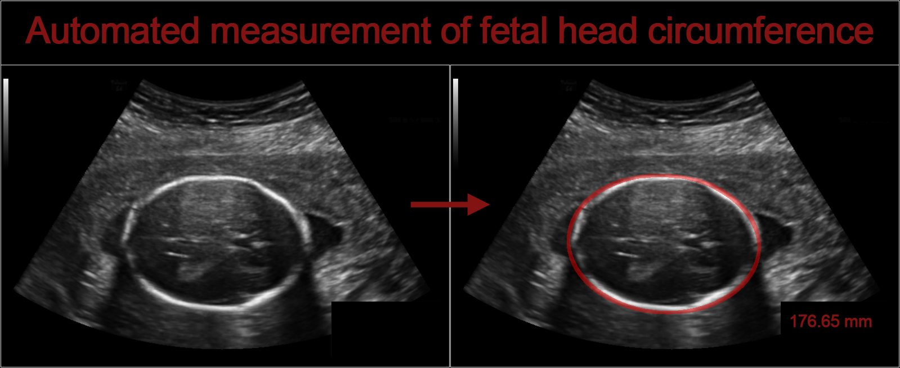
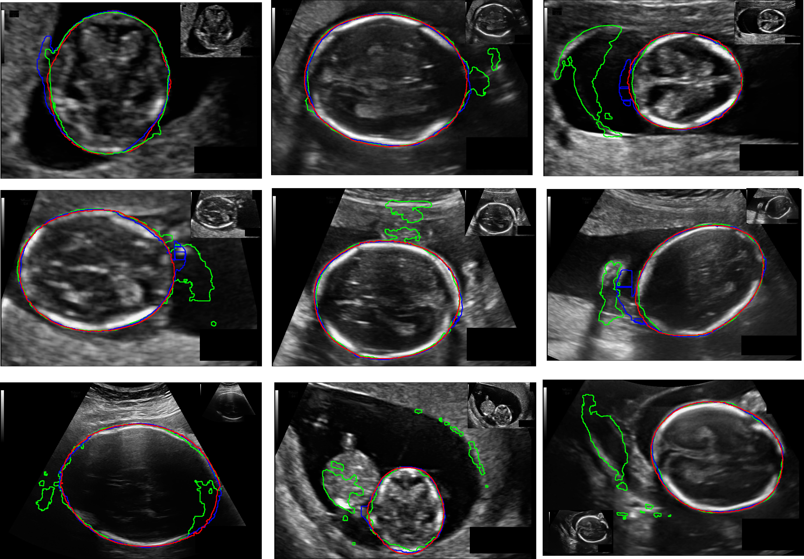

## DAG V-Net
### The code will be constantly updated(!!!2021-3-23!!!)

* This repository provides the code for ["Fetal ultrasound image segmentation for automatic head circumference biometry using deeply-supervised attention-gated V-Net"][paper_link]. 
* Our work now was Accepted by the Journal of Digital Imaging. If you want to cite this article, please use "Zeng, Y., Tsui, PH., Wu, W. et al. Fetal Ultrasound Image Segmentation for Automatic Head Circumference Biometry Using Deeply Supervised Attention-Gated V-Net. J Digit Imaging (2021)." https://doi.org/10.1007/s10278-020-00410-5


[paper_link]:https://link.springer.com/article/10.1007/s10278-020-00410-5

Fig. 1. Structure of DAG V-Net.


### Requirementss
Some important required packages include:
* tensorflow version >=1.12.0.
* opencv-python >=3.3.0
* pandas >=0.20.1
* python >= 3.6 
* Some basic python packages such as SimpleITK.


## Usages
### Data
First, you can download the dataset at [HC-18][data_link]. 
* Download the HC-18 training set that consists of 999 2D ultrasound images and their annotations. 
* Download the HC-18 test set that consists of 335 2D ultrasound images.  


Fig. 2. The official data sample.

[data_link]:https://hc18.grand-challenge.org/


### Preprocessing
* The annotation of this dataset are contours. We need to convert them into binary masks for segmentation.
```
python get_ground_truth.py
```

* data augmentation.
```
python augtest.py
```
### Train
To train DAG-Net in HC-18.
```
python main.py
```

### Test
To evaluate the trained model in HC-18.
```
python validation.py
```

## Result

Fig. 2. Fetal head segmentation.


## Acknowledgement
Part of the code is revised from [Attention-Gate-Networks][AG].

[AG]:https://github.com/ozan-oktay/Attention-Gated-Networks

## Contact
* email:799633204@qq.com
* wechat:18752726918
* QQ:799633204
* [CSDN][web_link].


[web_link]:https://hc18.grand-challenge.org/


