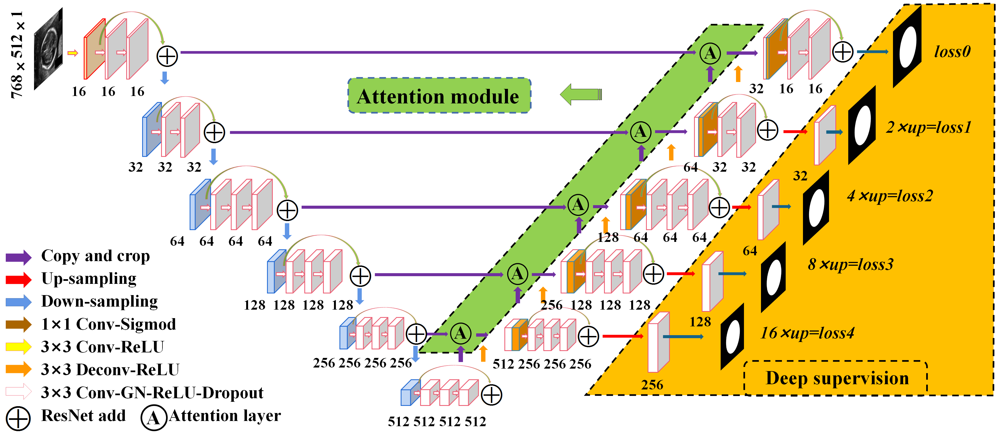

## DAG V-Net
The code will be constantly updated(!!!)

This repository provides the code for "Fetal ultrasound image segmentation for automatic head circumference biometry using deeply-supervised attention-gated V-Net". Our work now is Accepted by the Journal of Digital Imaging.


Fig. 1. Structure of DAG V-Net.


### Requirementss
Some important required packages include:
* tensorflow version >=1.12.0.
* opencv-python >=3.3.0
* pandas >=0.20.1
* python >= 3.6 
* Some basic python packages such as SimpleITK.


## Usages
### Data
1. First, you can download the dataset at [HC-18][data_link]. We used HC-18 task training dataset, To preprocess the dataset and save as ".npy", run:


Fig. 1. The official sample.


[data_link]:https://hc18.grand-challenge.org/

```
python isic_preprocess.py 
```

### Preprocessing

### Train

### Test

Fig. 2. Fetal head segmentation.

2. For conducting 5-fold cross-validation, split the preprocessed data into 5 fold and save their filenames. run:
```
python create_folder.py 
```


2. To train CA-Net in ISIC 2018 (taking 1st-fold validation for example), run:
```
python main.py --data ISIC2018 --val_folder folder1 --id Comp_Atten_Unet
```

3. To evaluate the trained model in ISIC 2018 (we added a test data in folder0, testing the 0th-fold validation for example), run:
```
python validation.py --data ISIC2018 --val_folder folder0 --id Comp_Atten_Unet
```
Our experimental results are shown in the table:


4. You can save the attention weight map in the middle step of the network to '/result' folder. Visualizing the attention weight above the original images, run:
```
python show_fused_heatmap.py
```
Visualzation of spatial attention weight map:


Visualzation of scale attention weight map:


## Acknowledgement
Part of the code is revised from [Attention-Gate-Networks][AG].

[AG]:https://github.com/ozan-oktay/Attention-Gated-Networks


